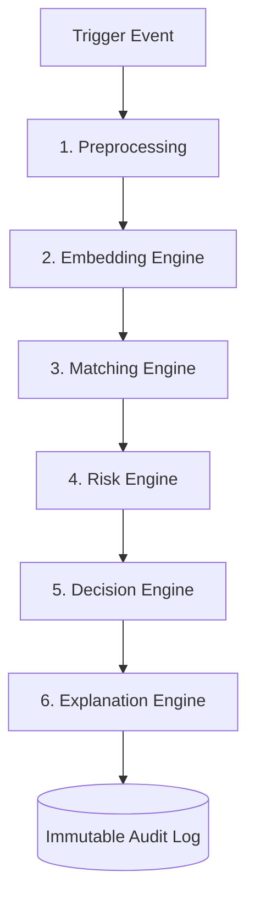

# NEXUM SHIELD 🛡️

**A zero-cost, highly-scalable Media Integrity & Authentication Engine.**

Sports organizations generate massive volumes of high-value digital media that rapidly scatter across global platforms. NEXUM SHIELD is the core detection engine designed to identify, mathematically authenticate, and instantly flag unauthorized use or misappropriation of proprietary digital assets in near real-time.

 

---

## 🏗️ System Architecture & Data Flow

Nexum Shield is built on a decoupled, event-driven architecture designed for extremely high throughput. The platform is logically divided into three primary components:

### 1. The Presentation Layer (Next.js Dashboard)
The control center for operators.
*   **Asset Ingestion:** Drag-and-drop UI to submit images for verification.
*   **Real-time Analytics:** Highly responsive UI that polls the backend and animates risk gauges organically.
*   **Audit Logging:** Displays the immutable log of all decisions previously calculated by the AI engine.

### 2. The Ingestion API (FastAPI)
The high-speed traffic coordinator. It acts as the "Bouncer".
*   **Workflow:**
    1. Receives the raw image from the Dashboard.
    2. Validates the file signature and size.
    3. Writes the original bytes safely into the Storage layer.
    4. Instantly fires an asynchronous HTTP trigger to the heavy AI Worker.
*   **Why it's isolated:** Ensures the UI never hangs waiting for the heavy AI math to compute.

### 3. The Worker Engine (The AI Brain)
The heavy analytical engine triggered by the Ingestion API. It executes a strict, 6-stage deterministic pipeline:



#### Detailed Pipeline Flow:
1.  **Preprocessing:** Validates the image integrity and prepares it for tensor conversion.
2.  **Embedding (CLIP ViT-B/32):** The image is passed through PyTorch and OpenAI's CLIP model, converting the visual concepts of the asset into a highly dense 512-dimensional vector signature.
3.  **Matching (Meta FAISS):** The vector signature is fired against a highly-optimized in-memory index of known proprietary assets. FAISS executes L2 normalized cosine similarity to mathematically prove how close the new image is to the protected images, even if it has been cropped, filtered, or altered.
4.  **Risk Score:** Extracts the highest vector similarity (e.g., `0.98`) and bounds it as the Deterministic Risk Coefficient.
5.  **Decision Policy:** An unbendable legal matrix routes the outcome:
    *   `> 0.90` ➡️ **BLOCK** (Definitive copyright match)
    *   `0.70 - 0.90` ➡️ **REVIEW** (Uncertainty boundary - needs manual review)
    *   `< 0.70` ➡️ **ALLOW** (No match in database)
6.  **Explanation & Audit:** Generates a human-readable justification for the decision and securely writes everything to the datastore.

---

## 🛠️ Technology Stack

We utilized a rigorous, production-grade technology stack prioritizing execution speed and mathematical determinism:

**AI & Machine Learning:**
*   **PyTorch**: Core deep learning tensor calculation framework.
*   **HuggingFace Transformers**: To execute the `openai/clip-vit-base-patch32` visual models.
*   **Meta FAISS (`faiss-cpu`)**: High-speed, in-memory continuous vector similarity search database.

**Backend Services:**
*   **Python 3.11**: Primary execution language.
*   **FastAPI**: Underpins both the Ingestion API and the Worker API for asynchronous, high-performance HTTP routing.
*   **Pydantic**: Guarantees strict data validation contracts passing through the 6-stage pipeline.

**Frontend Interface:**
*   **Next.js 14**: Server-side rendered React framework.
*   **Tailwind CSS**: Utility-first styling for the futuristic dark theme.
*   **Lucide React**: Modern iconography dynamically reflecting pipeline decisions.

*(Note: While designed for Google Cloud (Cloud Run, Cloud Storage, Pub/Sub, Firestore), the current hackathon deployment utilizes a local, Native Python execution environment mirroring Cloud infrastructure for zero-latency demonstrations).*

---

## 🚀 Quick Start (Native Execution)

No Docker. No Cloud Accounts required.

### 1. Start the Worker Brain
*On its first run, it will automatically download the 350MB CLIP model.*
```bash
cd nexum-backend/worker
pip install -r requirements.txt
python main.py
```

### 2. Start the Ingestion API
Open a second terminal window:
```bash
cd nexum-backend/ingestion
pip install -r requirements.txt
python main.py
```

### 3. Start the UI Dashboard
Open a third terminal window:
```bash
cd nexum-frontend
npm install
npm run dev
```

---

## 🎯 How to Demo the Platform

### 1. Train the Engine (Seed an Image)
Open the administrative Swagger UI at **http://localhost:8002/docs**. 
Expand `POST /admin/seed` and upload any reference image (e.g., an original official sports photo). This instantly saves the file's mathematical signature into the FAISS memory core as a protected asset.

### 2. Watch the Enforcer Fire
Go to the main dashboard at **http://localhost:3000/upload**. 
Drag and drop that **exact same image** (or a mildly cropped/filtered version) into the analyzer. 
The AI will calculate the mathematical drift, recognize the signature from the Seed database, and automatically slap it with a massive risk score and a **BLOCK** decision.

### 3. See the Bypass
Upload a completely unrelated picture. The FAISS vector search will return nothing, calculating a sub-threshold (< 0.70) score, and securely issue an **ALLOW** decision. 

Go to the **Audit Log** tab in the dashboard to see an immutable record of every decision safely captured.

---

## 🔮 Roadmap: Phase 2 (Market Integration)

This engine represents the core analytical "brain". To complete the solution of tracking unauthorized use *"across the internet"*, Phase 2 requires building the "eyes":
*   **Web Crawlers & Social Listeners:** Implementing automated bots to scrape Twitter, Instagram, and global sports blogs.
*   **Mass Ingestion:** Funneling scraped internet assets through the `/upload` API at scale 24/7.
*   **Legal Automation:** Auto-dispatching DMCA Takedown requests when the Worker yields a deterministic **BLOCK** decision on a scraped URL.
